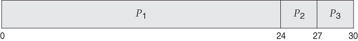

# <21, 10, 5, 20, 15, 30, 49, 25, 35, 44, 11> 작업의 걸리는 시간을 최소로 하는 탐욕적 기법 적용하기

### 운영체제 CPU 스케줄링의 예시와 같다. 

|P1|P2|P3|
|------|------|------|
|24|3|3|



```
평균 대기시간 = (0 + 24 + 27) / 3 = 17 이 된다.
```

<br>


```
위와 같이 p2 - p3 - p1 순으로 들어오게 되면 평균 대기시간 = (0 + 3 + 6 ) / 3 = 3 이 된다
```

<br>

```
따라서

[5, 10, 11, 15, 20, 21, 25, 30, 35, 44, 49]

위와같은 사진처럼 작업의 시간을 오름차순으로 정렬하여 진행하게 되면 대기시간을 최소로
줄일 수 있기 때문에 전체 작업(작업시간 + 대기시간)이 최소가 될 수 있다.

따라서 => 1127 이 나오게 된다
```