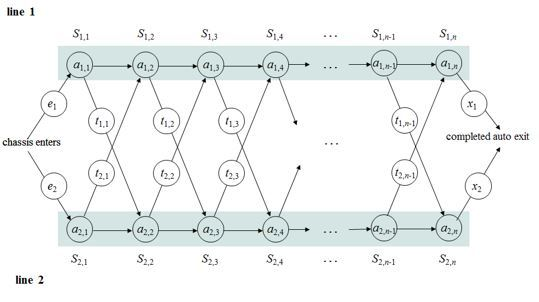

# 동적 프로그래밍이란?

```
1. 입력 크기가 작은 부분 문제들을 해결한 후, 해당 부분 문제의 해를 활용해서 보다 큰 크기의 부분 문제를 해결하고 최종적으로 전체
문제를 해결하는 알고리즘

2. 메모제이션 : 프로그램 실행 시 이전에 계산한 값을 저장하여, 다신 계산하지 않도록 하여 전체 실행 속도를 빠르게 하는 기술의 기법을 사용한다.

``` 

<br><br>

### 동적 계획법의 핵심은 하나의 문제를 단 한번만 푸는 것이 핵심이다.

```
일반적으로 분할 정복 기법은 동일한 문제를 여러번 풀어 중복이 된다는 단점이 있다(퀵, 병합 정렬은 제외) 하지만 피보나치 수열과 같은 
곳에서 분할정복을 사용한다면 아주 비효율적이라 할 수 있다.
```

<br><br>

### 동적 계획법의 중요한 가정 2가지

* 큰 문제를 작은 문제로 나눌 수 있다.

* 작은 문제에서 구한 정답은 그것을 포함하는 큰 문제에서도 동일하다.

<br><br>

### 동적 계획법의 예시 - Assembly-line-scheduling



```
위 그람과 같은 생산 라인에서 최소 경로를 구하는 문제이다. D[i][j]를 물건이 i번 생산라인의 j번째 공정에 있을 때, 오는데 걸리는 최소 시간으로 생각하자

초기값은 아래와 같다
D[1][1] = E[1] + S[1][1]
D[2][1] = E[2] + S[2][1]

여기서 물건이 i번 생산라인의 j번째 공정에 오게 되는 상황에서의 경로는 물건이 직전에 i번 생산라인의 j-1번째 공정으로부터 오거나, 3-i번 생산라인의 j-1번째 공정에서 오는 경우일 것이다.
물건이 i번 생산라인의 j-1번째 공정에서 오는 경우에 대한 것은 "D[i][j-1]" 일 것이다. 반면에 물건이 3-i번 생산라인의 j-1번째 공정에서 오는 경우에는 라인을 이동하는 시간을 더해 "D[3-i][j-1] + t[3-i][j-1]" 로 표현할 수 있다.
따라서 이 경우의 최적 해는 "D[1][N] + X[1]" 와 "D[2][N] + X[2]" 둘 중 작은 값일 것이다.
점화식으로 풀어보면 "D[i][j] = min(D[i][j-1], D[3-i][j-1] + t[3-i][j-1]) + S[i][j]" 으로 표현할 수 있을 것이다.
```

<br><br>

### 코드

<pre>
D = new int[3][N+1];
for (int i=1;i<3;i++) D[i][1] = E[i] + S[i][1];
for (int j=2;j<=N;j++){
    for (int i=1;i<3;i++){
        D[i][j] = Math.min(D[i][j-1],
                    D[3-i][j-1] + T[3-i][j-1]) + S[i][j];
    }
}
System.out.println("#" + ts + " " + Math.min(D[1][N] + X[1], D[2][N] + X[2]));
</pre>


