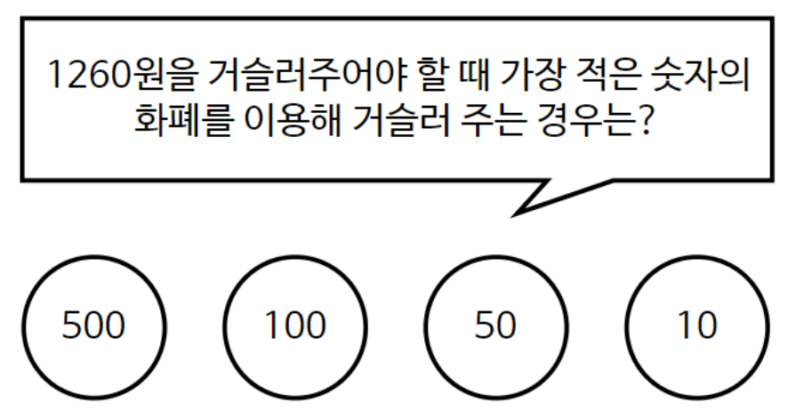

# 탐욕적 알고리즘 이란?

```
1. 해에 가까운 값을 구하기 위해 사용됨

2. 여러 경우 중 하나를 결정해야할 때 마다, 매 순간 최적이라고 생각되는 경우를 선택해 최종적인 값을 구하는 방식

3. 탐욕적 알고리즘은 항상 최적의 결과를 도출해내는 것은 아니지만 어느정도 최적의 해에 근접하게 구할 수 있다는 장점이 있다.

```

<br>

### 탐욕적 알고리즘의 예 - 동전 문제

* 지불해야 하는 값이 1260원 일 때 1원, 50원, 100원, 500원 동전으로 동전의 수가 가장 적게 지불하시오

* 가장 큰 동전부터 최대한 지불해서 값을 채우는 방식이다.

* 탐욕 알고리즘으로 매순간 최적이라고 생각되는 경우를 선택하면 된다.

<br>



```
이렇게 동전을 정렬 큰 순서대로 내림차순 정렬 시킨 후에 가장 큰 동전을 쓸 수 있는 만큼 사용한다.
그러면 500원2개, 100원 2개, 50원 1개, 10원 1개를 이용해서 1260원을 만들 수 있다.
```

<br><br>

### 그러면 왜 동전문제가 탐욕적 알고리즘 일까?? 

```
단순하게 거스름돈을 지불하는 상황에서 당장 눈앞에 보이는 큰 동전만을 생각하고 다른 동전은 생각하지 않기 때문에 매 순간 최적이라고
생각되는 경우를 선택하는 탐욕적 알고리즘이라고 할 수 있다. 
```

<br><br>

### 코드 

<pre>
public class Greedy {
    public static void main(String[] args) {
        int n = 1260;
        int count = 0;
        count += n / 500;  // 500원이 몇개 가능 한지 여부
        n %= 500;          // 500원 나눠진 개수 만큼 빼고 n에 저장
        count += n/ 100;
        n %= 100;
        count += n / 50;
        n %= 50;
        System.out.println(count);
    }
}
</pre>